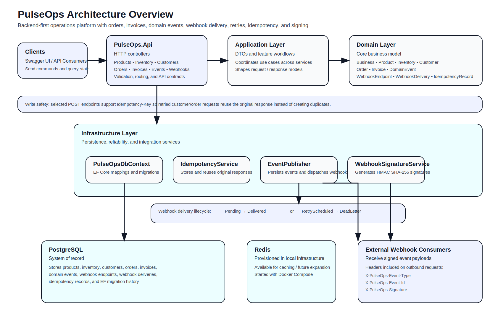

# PulseOps

PulseOps is a backend-first small business operations platform built with .NET, PostgreSQL, EF Core, Redis, and Docker.

The system models real-world business workflows and reliability patterns found in modern production systems, including order processing, inventory lifecycle management, billing, and event-driven integrations.

---

## Architecture Diagram



---

## Tech Stack

- .NET / ASP.NET Core Web API
- Entity Framework Core
- PostgreSQL
- Redis
- Docker Compose
- Swagger / OpenAPI
- xUnit

---

## Features

### Core Domain
- Product creation and management
- Inventory tracking and adjustments
- Customer management
- Order creation with validation
- Inventory reservation during order placement
- Order fulfillment with inventory reconciliation

### Billing
- Automatic invoice generation on order creation
- Invoice retrieval and status tracking
- Invoice payment updates

### Event System
- Domain event persistence for core business actions
- Event payload storage for observability
- Event inspection via API

### Webhooks
- Webhook endpoint registration per business
- Outbound event delivery to external systems
- Delivery tracking with status, attempts, and responses

### Reliability
- Retry scheduling with backoff
- Dead-letter handling after max attempts
- Manual retry and batch retry processing endpoints

### API Safety
- Idempotency key support for selected write endpoints
- Duplicate prevention for retried customer and order creation requests
- Reuse of original response for repeated requests

### Security
- HMAC SHA-256 webhook signing
- Per-endpoint signing secrets
- Signature header included on outbound webhook deliveries

---

## Project Structure

```text
src/
  PulseOps.Api
  PulseOps.Application
  PulseOps.Domain
  PulseOps.Infrastructure

tests/
  PulseOps.UnitTests

  ## Running Locally

These steps assume a fresh clone of the repository.

### 1. Clone the repository

```bash
git clone https://github.com/nicole-creech/pulseops.git
cd pulseops
```

### 2. Prerequisites

Make sure you have installed:

- .NET SDK (v8+ or v10)
- Docker Desktop (running)

Verify:

```bash
dotnet --version
docker --version
docker compose version
```

### 3. Start infrastructure (PostgreSQL + Redis)

```bash
docker compose up -d
```

Verify containers are running:

```bash
docker ps
```

### 4. Apply database migrations

```bash
dotnet ef database update \
  --project src/PulseOps.Infrastructure \
  --startup-project src/PulseOps.Api
```

### 5. Run the API

```bash
dotnet run --project src/PulseOps.Api
```

You should see output similar to:

```text
Now listening on: https://localhost:xxxx
```

### 6. Open Swagger UI

Open the URL shown in the terminal, typically:

```text
https://localhost:xxxx/swagger
```

### 7. Seed data

On startup, the app creates a demo business:

```text
Business ID: 11111111-1111-1111-1111-111111111111
```

Use this ID for local testing.
